 

  <!-- Header Banner -->
  <picture>
    <source media="(prefers-color-scheme: dark)"
      srcset="https://capsule-render.vercel.app/api?type=waving&color=0:1a1b26,100:7aa2f7&height=280&section=header&text=purushothaman-web&fontSize=80&animation=fadeIn&fontColor=ffffff&desc=Full%20Stack%20Developer&descFontSize=20">
    <source media="(prefers-color-scheme: light)"
      srcset="https://capsule-render.vercel.app/api?type=waving&color=0:cae8ff,100:2563EB&height=280&section=header&text=purushothaman-web&fontSize=80&animation=fadeIn&fontColor=ffffff&desc=Full%20Stack%20Developer&descFontSize=20">
    
  </picture>

  <!-- Typing SVG -->
  <picture>
    <source media="(prefers-color-scheme: dark)"
      srcset="https://readme-typing-svg.herokuapp.com?font=Fira+Code&pause=1000&color=7aa2f7&random=false&width=435&lines=Full+Stack+JavaScript+Developer;Open+Source+Enthusiast;MERN+Stack+Specialist;Building+Scalable+Web+Apps&center=true">
    <source media="(prefers-color-scheme: light)"
      srcset="https://readme-typing-svg.herokuapp.com?font=Fira+Code&pause=1000&color=2563EB&random=false&width=435&lines=Full+Stack+JavaScript+Developer;Open+Source+Enthusiast;MERN+Stack+Specialist;Building+Scalable+Web+Apps&center=true">
    
  </picture>

   

  💻 <strong>MERN Stack</strong> Developer building scalable full-stack web applications 
  🤝 Open to collaborating on <strong>MERN & open-source</strong> projects. 
  🌱 Learning advanced <strong>Node.js</strong>, <strong>MongoDB</strong> performance, <strong>Docker</strong> & <strong>DevOps</strong>. 
  💬 Ask me about <strong>JavaScript</strong>, <strong>React</strong>, <strong>Node.js</strong>, <strong>APIs</strong> & <strong>performance</strong>. 
  ⚡ Passionate about crafting smooth UX backed by efficient backend logic

## 🌐 Socials:

&nbsp;&nbsp;&nbsp;&nbsp;

&nbsp;&nbsp;&nbsp;&nbsp;

## 📊 GitHub Stats

  

## 💻 Tech Stack & Tools

| Category | Skills |
| :--- | :--- |
| **🖥️ Frontend** |        |
| **⚙️ Backend** |      |
| **🗄️ Databases** |     |
| **☁️ DevOps** |   |
| **🧰 Tools** |       |

## 🖥️ Activity & Contributions

  <!-- Terminal Build Log -->
  <picture>
    <source media="(prefers-color-scheme: dark)"
      srcset="https://readme-typing-svg.herokuapp.com?font=Fira+Code&weight=500&size=20&pause=1000&color=7aa2f7&background=1a1b26&center=true&vCenter=true&width=500&height=80&lines=%3E+git+commit+-m+%22Coding+every+day%21%22;%3E+git+push+origin+main;%3E+Success%21+%F0%9F%9A%80">
    <source media="(prefers-color-scheme: light)"
      srcset="https://readme-typing-svg.herokuapp.com?font=Fira+Code&weight=500&size=20&pause=1000&color=2563EB&background=F7F7F7&center=true&vCenter=true&width=500&height=80&lines=%3E+git+commit+-m+%22Coding+every+day%21%22;%3E+git+push+origin+main;%3E+Success%21+%F0%9F%9A%80">
    
  </picture>

   

  <!-- Snake Contribution Graph -->
  <picture>
    <source media="(prefers-color-scheme: dark)"
      srcset="https://raw.githubusercontent.com/purushothaman-web/purushothaman-web/output/github-contribution-grid-snake-dark.svg">
    <source media="(prefers-color-scheme: light)"
      srcset="https://raw.githubusercontent.com/purushothaman-web/purushothaman-web/output/github-contribution-grid-snake.svg">
    
  </picture>

## 🧩 Random Dev Joke

  <picture>
    <source media="(prefers-color-scheme: dark)"
      srcset="https://readme-jokes.vercel.app/api?theme=tokyonight">
    <source media="(prefers-color-scheme: light)"
      srcset="https://readme-jokes.vercel.app/api?theme=default">
    
  </picture>

<!-- Animated Footer -->
<picture>
  <source media="(prefers-color-scheme: dark)"
    srcset=".github/assets/submarine-footer.svg">
  <source media="(prefers-color-scheme: light)"
    srcset=".github/assets/submarine-footer-light.svg">
  
</picture>

